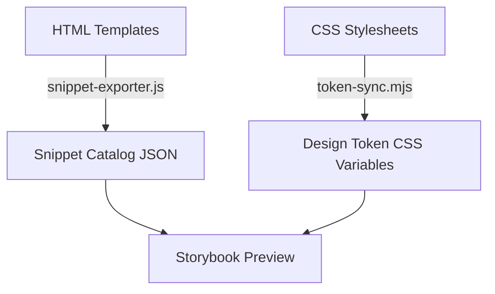

# Architecture & Technical Design Overview

This document provides a comprehensive overview of the UI-Verse project layout, component modularization, styling mechanisms, and validation workflows.

## Component Layout Structure
Each component consists of:
1. **HTML Template**: Located in the project root directory (e.g., `button.html`, `cards.html`).
2. **CSS Stylesheet**: Co-located companion files containing styles for the templates (e.g., `button.css`, `cards.css`).
3. **Interactive Scripts**: Optional JS logic embedded or stored as `.js` companion assets.

## Core Asset Integration Pipeline

## Quality Control Pipeline
Our quality checks run several validation phases before code is integrated:
- **Linting Phase**: ESLint for script validation, Stylelint for CSS style checks, and Html-Validate for structural DOM checking.
- **Accessbility Gate**: `audit:a11y` tests for color contrast ratio and keyboard focusable attributes.
- **Visual Baseline**: Playwright compares elements to pixel-perfect visual snapshots.
